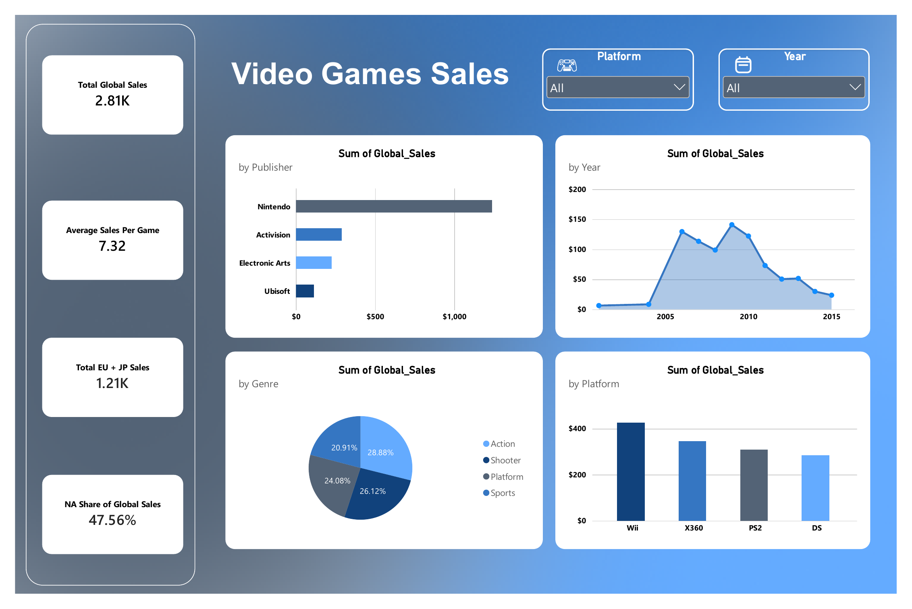

# Video Games Sales Dashboard

A dashboard analyzing global video game sales data, built to explore sales performance across publishers, genres, platforms, and years.

## Overview

This project cleans and analyzes a video game sales dataset covering thousands of titles released between 1980 and 2016, then presents the results in an interactive dashboard with filters for platform and year.

## Dataset

The dataset contains the following fields:

| Column | Description |
|---|---|
| Rank | Overall sales rank |
| Name / Game | Title of the game |
| Platform | Console/platform the game was released on |
| Year | Release year |
| Genre | Game genre |
| Publisher | Publishing company |
| NA_Sales | Sales in North America (millions) |
| EU_Sales | Sales in Europe (millions) |
| JP_Sales | Sales in Japan (millions) |
| Other_Sales | Sales in the rest of the world (millions) |
| Global_Sales | Total worldwide sales (millions) |

**File:** `VideoGamesSales.xlsx`, containing three sheets:
- `Raw Data` – the original, unprocessed dataset
- `Cleaned Data` – cleaned data with derived/calculated fields (e.g. game age category, sales category, publisher reference, yearly aggregates)
- `PivotTable` – summary tables used to feed the dashboard visuals

## Dashboard



### Key metrics
- **Total Global Sales** – sum of worldwide sales across all titles
- **Average Sales Per Game** – mean global sales per title
- **Total EU + JP Sales** – combined European and Japanese sales
- **NA Share of Global Sales** – North America's percentage of total global sales

### Visuals
- **Sales by Publisher** – top publishers ranked by total global sales
- **Sales by Year** – sales trend over time
- **Sales by Genre** – distribution of sales across genres
- **Sales by Platform** – top platforms by total global sales

### Filters
- **Platform** – filter all visuals by a specific console/platform
- **Year** – filter all visuals by a specific release year

## Key Findings

- Nintendo leads all publishers by a significant margin in total global sales.
- Sales activity peaked between 2005 and 2010, followed by a gradual decline.
- Action, Shooter, Platform, and Sports genres account for roughly the same share of sales, each in the 20–29% range.
- The Wii is the top-selling platform in this dataset, ahead of the Xbox 360, PS2, and DS.
- North America accounts for close to half (≈47.5%) of global sales.

## Data Cleaning

The `Cleaned Data` sheet applies the following transformations to the raw dataset:
- Standardizes game titles (trimmed, proper case)
- Categorizes titles as "Legacy Title" or "Modern Title" based on release year
- Buckets titles into global sales categories
- Cross-references publishers against a reference list
- Calculates per-publisher game counts and yearly sales aggregates

## Tools Used

- Excel / spreadsheet formulas for data cleaning and pivot tables
- Dashboard built using pivot charts and slicers

## Files

```
├── VideoGamesSales.xlsx     # Raw data, cleaned data, and pivot tables
├── dashboard_preview.png    # Dashboard screenshot
└── README.md                # Project documentation
```

## How to Use

1. Open `VideoGamesSales.xlsx` in Excel.
2. Review the `Raw Data` and `Cleaned Data` sheets to see the source and processed data.
3. Go to the dashboard sheet and use the **Platform** and **Year** filters to explore the data interactively.

## License

This project is intended for educational and portfolio purposes. The underlying video game sales dataset is publicly available and commonly used for data analysis practice.
